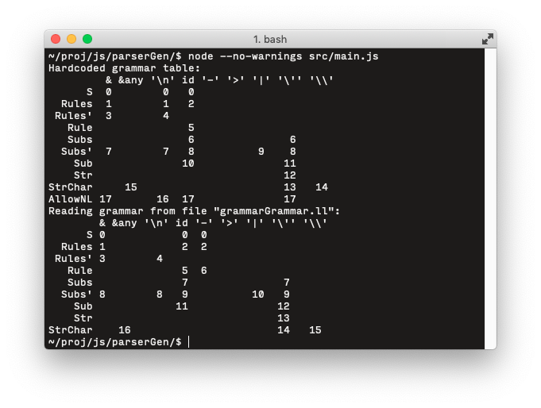

parserGen is an LL(1) parser generator framework, that focuses on advanced error-reporting.

## Status

The screenshot shows parserGen displaying the hardcoded LL(1) parsing table that is used to read user grammars, and the roughly identical parsing table generated from the [user grammar file](src/grammarGrammar.ll).

A [demo screencast](https://youtu.be/txinLs_xuvc) demonstrates the error-reporting capabilities.

### Features:
- LL(1) grammar parsing
- Generation of the LL(1) parsing table
- Clever error-reporting

### Planned Features:
- Generation of tokenizers
- Curses-based dashboard for grammar analysis and debugging

## Building
Open-GraphEq uses [Node.js](https://nodejs.org/en/) and [yarn](https://yarnpkg.com/en/). After installing these dependencies, simply run `yarn` from the project folder.

## Manual
Use `node --no-warnings src/main.js` to launch the parserGen demo. `--no-warnings` is required to silence the warnings that come from using the experimental [fs Promises API](https://nodejs.org/api/fs.html#fs_fs_promises_api).
